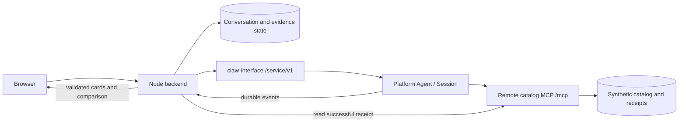

# Product Advisor implementation plan

Updated 2026-10-02. The application, standalone MCP, key-only launcher, and actual staging verification are implemented. [README.md](README.md) describes the current entry flow; [VALIDATION.md](VALIDATION.md) distinguishes offline and live evidence. The project interface, Agent responses, examples, and documentation are English; currency remains CNY.

## Scope and repository context

This session owns only `product-advisor/`. Workspace/repository rules, shared handoff, outline, Platform contract, session prompt, and app handoff were read before implementation. There are no nested app rules. The package installs independently and uses published SDKs without sibling imports or local overrides.

The worktree is `/Users/wangfulong/src/zoo/.worktrees/product-advisor`, branch `feature/product-advisor-plan`. It originally started at the actual PR #19 head `cd932491bcf98eddb7e6650375b6586565c911c5`. PR #19 merged on 2026-10-02 at `3696818d31d2bd42a36b05af897bf78b5f9aae0f`; the feature PR now integrates and targets `main`. No automatic reset, stash, or rebase is used.

The user task is complete when a shopper can enter requirements, search products through remote MCP, inspect grounded cards, compare specifications, shortlist options, and continue the same conversation. The catalog has three categories with six synthetic records each. Names, models, prices, parameters, and illustrations are original examples, not real offers. Checkout and real merchant purchasing are outside this demo.

## Verified Platform contract

Source support and deployed behavior are separate. The contract below was inspected in published SDK 0.9.0, the public gateway, Engine, and official documentation. Actual staging results are recorded separately.

| Capability | Contract | Application use |
| --- | --- | --- |
| Project key | `zwp_live_` on `/service/v1`; gateway supplies owner/Org/Project | Server-side key; setup creates the app-owned Agent |
| Remote MCP | `resource.mcp[]`, remote HTTP/SSE; no stdio, loopback/private destination, or redirects | Public HTTPS `/mcp`, Streamable HTTP |
| MCP authentication | Public gateway rejects credential-write routes | Public synthetic read-only catalog, no bearer/OAuth setup |
| Tool selection | Raw tool names in toolFilter, direct/deferred exposure | Three exact tools with direct exposure |
| Native approval | Permissions are separate from exposure; REST list/resolve may return 501 | Automatic search, confirmed details/comparison, allow-once/deny |
| Sessions | createSession, postEvents, durable events, cursor resume | Persistent conversation and follow-up state |
| Assistant output | Durable complete `agent.assistant` messages | Parse complete blocks, not append-only token deltas |
| Tool results | Public `agent.tool` resultPreview, currently limited to 512 characters | Short receipt ID and remote full-result read |
| MCP failures | `agent.error`; failed discovery may omit tools | Separate connection, tool, and turn outcomes |
| Environment/Skills | No top-level management through the current Project-key router | Default environment without extra setup prerequisites |

The server name is `catalog`, without underscores. The application never sends the Project key to MCP.

## User flow and interface

The initial form presents category, CNY budget limit, typed hard filters, and a needs message. Three editable examples cover laptops, monitors, and headphones. Explicit English budget, RAM, and weight statements update confirmed requirements; ambiguous changes require clarification. Missing budget/category cannot produce a grounded recommendation.

After search, show candidates and up to three recommended cards. Cards contain the synthetic illustration, name, catalog price, budget difference, known specifications, matching reasons, unknown-field caveats, source record, and version. Users select 2–4 products from the same category/version for comparison.

Comparison uses remote raw values and labels unknowns as “Not provided by catalog”. A follow-up such as “Lower the budget to CNY 5000” stays in the same Session. New results record new conditions; old snapshots retain original conditions and facts.

| Interface area | Contents | Interaction |
| --- | --- | --- |
| Header and history | App name, synthetic marker, service state, saved conversations | Start or restore a conversation |
| Requirements | Category, budget, typed filters, editable examples | Confirm and change hard conditions |
| Conversation | Clarification, conclusions, follow-up input, progress | Continue the same Session or stop a turn |
| Results | Candidates, shortlist, evidence disclosure, specification matrix | Select, inspect details, and compare |
| Native approval | Purpose, tool arguments, deadline, delivery state | Allow once or deny; wait for execution state |
| Collapsed debug | Tool name/phase, actual arguments JSON, receipt, failure state | Inspect request evidence without replacing the shopping UI |

The desktop layout retains the approved shopping interface. Narrow screens stack content; wide tables and JSON scroll inside their own regions. Controls are keyboard-accessible, focus is visible, and errors do not rely on color alone. Empty results explain that requirements must be changed explicitly. Without successful evidence, the app displays no seeded recommendations.

## Technical structure

One independent npm package uses Node 22.20+, TypeScript, React/Vite, Express, and SQLite. Dependencies are pinned in the local lockfile: published `@zoowork-ai/sdk@0.9.0` and `@modelcontextprotocol/sdk@1.29.0`, with no package patch.



The browser calls only the application's backend and receives no Project key. The backend owns Sessions, native approvals, event recovery, and evidence validation. Platform performs model execution and remote MCP discovery/calls. The catalog is an independent HTTP service; the backend never substitutes local catalog functions for a denied or failed Platform call.

Browser APIs use app conversation IDs. The server maps these to recorded Agent/Session IDs and checks visitor ownership. APIs cover conversation create/list/read, messages, events, approvals, comparison, details, and interruption. Details/comparison post validated requests into the same Session. Write APIs require the configured Origin. The visitor cookie is signed, HttpOnly, SameSite, and Secure when the origin uses HTTPS. Public Web hosting additionally requires formal authentication.

```text
product-advisor/
  src/agent.ts              Persona, MCP declaration, tool policy
  src/platform.ts           SDK lifecycle and recovery helpers
  src/server/               Browser API, SDK event worker, native approvals
  src/domain/               Requirements, evidence, recommendations, validation
  src/storage/              SQLite conversation and receipt/audit stores
  src/ui/                   React shopping interface
  mcp/server.ts             Streamable HTTP, health, public evidence read
  mcp/catalog.ts            Search, details, and comparison implementation
  data/catalog.json         18 versioned synthetic products
  public/products/          Original category illustrations
  scripts/                  Demo, lifecycle, probe, and live verification
  test/                     Offline domain/API/contract/recovery checks
  .local/                   Ignored private state and recovery records
```

## Catalog and MCP contracts

Laptops include RAM, weight, battery, CPU, and ports. Monitors include size, resolution, refresh rate, and USB-C power. Headphones include weight, battery, ANC, and connection. Each category includes unknown fields, a budget boundary, and an unavailable record. Search/details/comparison use the same versioned catalog. The English catalog is `demo-2026-10-02-en`; older immutable receipts keep their original facts.

| Tool | Input | Result and bounds |
| --- | --- | --- |
| `search_products` | Category, optional exact-model query, maxPriceMinor, typed filters, limit | Stable filtered summaries, total, version, receipt; default limit 6, maximum 12 |
| `get_products` | 1–4 IDs, exact catalogVersion | Full records, null unknowns; explicit errors for unknown IDs/version |
| `compare_products` | 2–4 same-category IDs, version, optional attributes | Raw parameter matrix; no invented scores |

Amounts are integer CNY minor units. Hard filters execute in the server; missing required facts fail the filter. No match is a successful empty result, distinct from invalid input and connection failure. Input/output schemas and size/count bounds are enforced. Read-only annotations describe behavior but are not access control.

Official stateless Streamable HTTP handles initialize/list/call with JSON responses. GET `/mcp` may return 405 because there is no independent SSE channel. Offline checks start the real HTTP server and official MCP client, rather than calling only domain functions.

## Full results and receipts

Engine normalizes structuredContent into a formatted JSON preview with a `structuredContent:` prefix and a 512-character limit. A content-only prefix would not reliably survive normalization. Successful MCP results place receiptId, catalogVersion, and tool first, before product data; they also include mirrored JSON text for ordinary clients.

The server persists an immutable snapshot before returning success. `GET /evidence/:receiptId` reads that snapshot and never executes a new search or comparison. The public payload contains only synthetic facts and version, without user text, identity, Session, runtime context, or credentials. Random receipt IDs are not authentication and must not protect private business data.

The backend extracts a constrained receipt ID only from a successful tool-end for this Session and the declared catalog tools. It reads a fixed configured origin, not a model-supplied URL. It validates schema, tool, version, and IDs before associating evidence with toolCallId. Details/comparison IDs must match saved start arguments; searched products are checked again against confirmed requirements.

Receipt hydration failures persist independent recovery jobs. Bounded read retries are safe because no new tool runs. Remote retention is at least 24 hours and hosted servers need persistent storage. Hydrated local snapshots preserve history. Missing or expired receipts cannot be replaced with current catalog facts. This receipt protocol belongs to this example, not to a new Platform API guarantee.

## Agent configuration and remote access

The Agent disables global skills, uses session sandbox scope, and declares only three catalog tools. Search is `always_allow`; details/comparison are `always_ask` and additionally set `requireConfirmation: true`. Reviewed Engine permission rendering maps that flag to mandatory approval and allow-once/deny. SDK 0.9.0 omits it from `McpToolPermissionOverride`; the app extends the type locally without changing SDK runtime serialization. The gap is tracked in [SDK issue #39](https://github.com/SerendipityOneInc/zoowork-sdk-typescript/issues/39).

The persona requires English responses, clarification of missing conditions, facts from successful catalog results, preserved unknowns, and no bypass after denial. Catalog text is untrusted data. Runtime context is only for private audit correlation; `_meta` is not authentication and is excluded from public evidence.

The default `npm run demo` needs only a Project key after Node/cloudflared installation. It starts the local MCP, opens a temporary HTTPS tunnel, waits for registration and DNS/health readiness, verifies discovery, and creates or updates the same app-owned Agent. A hosted `MCP_PUBLIC_URL` skips the tunnel. Cloudflared receives an allowlisted environment without the Project key. The private cookie secret is generated atomically and reused. A local lifecycle lock prevents competing launchers.

The launcher verifies the local Web port before remote creation. Agent create/update requests are saved exactly before sending. Restart completes a pending operation before applying a new tunnel URL. It does not create a replacement Agent after ambiguity. Unexpected tunnel termination stops the app without paid retries. Normal shutdown closes local services but preserves remote history for explicit cleanup.

For separate hosting, expose public HTTPS `/mcp`, `/health`, and `/evidence/` consistently, preserve headers/body, avoid redirects/login pages, configure allowed origins/hosts, and persist receipts. Local and public probes are protocol checks. Actual Platform events plus server audit and matching receipts establish remote execution. Manual `configure` validates recorded labels and saves pending updates; environment edits alone do not change an Agent. Do not configure during an active turn.

## Approvals, denial, and failures

Approval records are Agent-level. The backend filters and rechecks the Session against the visitor-owned conversation before exposing or resolving them. The UI intersects allow-once/deny with actual allowed_decisions. Decisions are persisted before delivery; an uncertain response permits only resubmitting that same decision. `signaled`/202 acknowledges submission, not completion.

Tool events pair by toolCallId and approval events by approvalId. A blocked tool without deniedReason awaits approval. Actual denial emits resolved=deny and then blocked/approval-denied without tool-end; projection and history recovery show “Not executed”. Denial preserves successful search summaries, does not hydrate denied results, and never triggers a local substitute or another tool for the same intent. Repeated denied intent stops the turn until explicit user action. Public catalog access by other callers is unaffected, which is why its data is synthetic.

| Failure | User state and recovery |
| --- | --- |
| Connection/authentication failed | No new evidence; retain prior results, correct endpoint/proxy, explicitly query again |
| Individual tool isError | Failed facts cannot enter recommendations; other successful facts remain |
| Successful empty search | No matching products; user decides whether to change constraints |
| Expired/handled approval | Refresh native state; never send an old approval to a new call |
| approvals 501 | Stop details/comparison and report native approvals unavailable |
| Stream interruption | Resume cursor/REST history without reposting user input |
| Missing/expired receipt | Preserve hydration job; bounded read recovery or an explicit new query |
| Key/owner/billing failure | Preserve state and report configuration/credit action; no automatic paid retry |

`agent.error` is not a turn terminator, and succeeded `run.finished` does not mean every tool succeeded. Discovery failure can omit tools while the model still answers; without successful evidence, the app cannot claim a new search. Recovery can depend on config pin/TTL, so the demo does not promise immediate recovery or automatically bump config_version.

## Durable state and recommendation validation

SQLite saves visitor/conversation/Agent/Session mapping, requirements, events, cursor, tool/approval state, evidence, shortlist, selections, and pending operations. Ownership is checked on history, events, messages, approvals, and comparison. The server supplies actor.ref for attribution; it does not replace authorization.

createSession body/key and postEvents idempotency_key are saved before delivery. Recovery uses the original body/key and recorded IDs. Ambiguous creation and failed cleanup keep private state. The event worker runs independently of browser SSE, deduplicates Session+seq, and saves event/projection/cursor transactionally. Replay/restart/multiple tabs cannot create duplicate cards or approvals. Only one concurrent follow-up is accepted.

The model has no strict JSON/schema-output contract. It emits a `product-advisor-result` block with type, product IDs, receipts, and bounded reason codes. The model ranks; the app verifies. Facts, prices, images, and source records come from remote snapshots. Reasons use checked budget/RAM/weight/battery predicates; unknown or unsupported reasons are omitted. Hard failures cannot be called matching recommendations.

New recommendations require current-turn successful receipts. Comparison verifies known product IDs and one version before posting a remote request. Local presentation of acquired facts is not a new MCP comparison. Invalid model formatting leaves validated candidates available and does not launch a paid JSON-repair turn. Unverified prose cannot become product facts.

## Implementation sequence and completion criteria

The implementation sequence was contracts/HTTP receipt round-trip, catalog and hosting, SDK lifecycle/durable state, shopping UI and recovery, independent checks/docs, bounded real feature staging, then the app-only PR. The key-only launcher and English project scope are included in the delivered implementation.

Completion requires:

- Browser input, search, grounded cards/evidence, approved details/comparison, follow-ups, history/restart recovery, and keyboard/narrow-screen use.
- The CNY 6500 / minimum 16 GB example excludes lap-03/lap-04 and unavailable data; unknown hard facts fail matching.
- Lower-budget recommendations obey the new budget while earlier snapshots remain unchanged.
- Denied remote operations execute zero times according to server audit, not merely the UI.
- Empty results, unknown products/fields, invalid model blocks, unavailable approvals, and connection failure have explicit states without invented recommendations.
- Independent `npm ci`, `npm run check`, and `npm run build`; no credentials, workspace links, or SDK overrides in offline CI.
- Offline coverage for domain boundaries, HTTP MCP schemas/receipts, ownership/Session approvals, pending decisions, idempotency, replay, and restart.
- Accurate licenses, source references, no committed secrets, and clear offline/live verification boundaries.

Each bounded staging run allows at most one temporary Agent, two Sessions, and four user turns. No automatic paid retries or production credentials. Session A searches and separately approves details/comparison, then lowers budget. Session B searches and denies details, then uses a controlled unavailable endpoint on that same test Agent. Only recorded resources with matching labels/metadata may be cleaned; no Project scan. Evidence includes tool/approval states, audit counts, receipt/version consistency, stream/REST replay, and cleanup. Actual staging passed on 2026-10-02; see VALIDATION for its exact scope.

## Source snapshots

| Source | Inspected snapshot |
| --- | --- |
| Shared handoff/Platform contract | `cd932491bcf98eddb7e6650375b6586565c911c5` |
| [Published SDK v0.9.0](https://github.com/SerendipityOneInc/zoowork-sdk-typescript/blob/6e205a2ac68f20a274583fbdfc7dc2f7379097a9/src/client.ts) | `6e205a2ac68f20a274583fbdfc7dc2f7379097a9` |
| [Gateway router](https://github.com/SerendipityOneInc/ecap-workspace/blob/73cffba7f/services/claw-interface/app/routes/service_api/router.py) and [Agent routing](https://github.com/SerendipityOneInc/ecap-workspace/blob/73cffba7f/services/claw-interface/app/routes/service_api/_agents.py) | `73cffba7f`; later inspected `4184093a8214cd2244f752616aac64ce23e6923f` had no relevant gateway changes |
| [MCP](https://github.com/SerendipityOneInc/zoowork-agents-docs/blob/83ab0521fcb45db13f993d327abf001636ef9e7a/docs/en/build/mcp.md), [permissions](https://github.com/SerendipityOneInc/zoowork-agents-docs/blob/83ab0521fcb45db13f993d327abf001636ef9e7a/docs/en/build/permissions.md), [events](https://github.com/SerendipityOneInc/zoowork-agents-docs/blob/83ab0521fcb45db13f993d327abf001636ef9e7a/docs/en/build/events.md) | Official docs repository `83ab0521fcb45db13f993d327abf001636ef9e7a` |
| [Engine MCP mapping](https://github.com/SerendipityOneInc/zooclaw-engine/blob/bdfc79ec6a70a769255b8b4d4f0a24a43ab72c2b/services/agent-worker/src/activities/mcp-tools.ts), [preview](https://github.com/SerendipityOneInc/zooclaw-engine/blob/bdfc79ec6a70a769255b8b4d4f0a24a43ab72c2b/services/agent-worker/src/activities/activity-message-helpers.ts), [permission rendering](https://github.com/SerendipityOneInc/zooclaw-engine/blob/bdfc79ec6a70a769255b8b4d4f0a24a43ab72c2b/services/controld/src/render/mcp-permissions.ts) | `bdfc79ec6a70a769255b8b4d4f0a24a43ab72c2b` |
| [MCP SDK v1.29.0](https://github.com/modelcontextprotocol/typescript-sdk/tree/e12cbd7078db388152f6e839abdbe09ba01f3f32) | `e12cbd7078db388152f6e839abdbe09ba01f3f32`, Node >=18 |
| [Streamable HTTP specification](https://modelcontextprotocol.io/specification/2025-11-25/basic/transports) | Official POST/GET/Origin contract |

Other repositories were inspected read-only; their checkouts, credentials, and development environments were not modified. Source support was verified before live deployment, and actual approval/receipt/failure results are documented separately. Application/MCP/data/illustrations are original; dependencies retain their licenses. Additional references are in REFERENCES.md.
