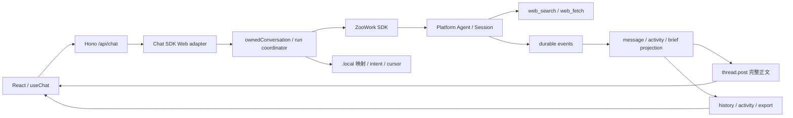

# Research Assistant 实现方案

状态：Finn 已在当前 session 以「搞。」批准开始实现。应用、离线验证和小规模 staging 已完成。
原方案保留在本文；实际验证及差异见 [VALIDATION.md](VALIDATION.md) 和下方实施记录。

核对日期：2026-10-01。首版范围已确认：本地单用户 starter。
产品范围见 [PRODUCT.md](PRODUCT.md)，固定源码快照和复用记录见 [REFERENCES.md](REFERENCES.md)。

## 1. 建议

使用 React、Hono 和一个长期运行的 Node 服务，接入 Vercel Chat SDK 官方 Web adapter。
浏览器只访问应用后端；后端用已发布的 `@zoowork-ai/sdk@0.9.0` 操作 Platform Agent 和 Session。

复用 Claude 示例的 Web 接线、路由组织和界面组件基础，重写 Platform bridge、历史投影和研究
prompt。主界面突出完整简报与来源，同时保留对话、实际研究活动和历史版本。

Platform 保存对话正文和事件。应用在 ignored `.local/` 保存 conversation → Agent/Session
归属映射、创建/发送 intent 和恢复 cursor。intent 是发送前落盘的精确请求及其稳定身份，用来在
响应丢失时核对操作是否已经发生。无需另建一套对话数据库。

Chat SDK 的流式 HTTP transport 不代表 Platform 提供 token streaming。收到 durable
`agent.assistant` 后整条展示；研究期间展示真实 search/fetch 活动，不模拟打字或完成百分比。

## 2. 起点与工作边界

- 已完整读取 workspace `AGENTS.md`、新 worktree 的仓库 `AGENTS.md`、`docs/HANDOFF.md`、
  `docs/OUTLINE.md`、`docs/PLATFORM.md`、session prompt，以及本应用 README、原 PLAN。
  应用目录没有额外 `AGENTS.md` 或 `CLAUDE.md`。
- 已执行 `git fetch --prune origin`。PR #19 尚未合并，状态 `OPEN`，head 是
  `cd932491bcf98eddb7e6650375b6586565c911c5`，与 remote branch 一致。
- 独立 branch：`feature/research-assistant-plan`。
- 独立 worktree：`/Users/wangfulong/src/zoo/zoowork-quickstarts-worktrees/research-assistant`。
- 实施只修改本应用代码/文档及必要的共享 references，不修改其他应用、SDK 或 Platform。
- 实现启动时再核对 PR #19。仍 open 时 feature PR base 用 `feature/platform-demo-handoffs`，
  合并后用 main。需要调整已有 branch 时先核对方案和 upstream 差异，不自动 reset、stash 或 rebase。
- 提交使用 `finn-srp <finn@srp.one>`；当前 GitHub 身份已核实为 `finn930`。

## 3. Platform 能力与界面边界

下表记录准备阶段的发布包/源码支持。当时未读取 SDK credentials，也未执行 live API 请求，不能据此
推断部署可用性。快照为 SDK `0.9.0`、公共文档 `83ab052`、ECAP main `4184093`。

| 能力 | 核对结果 | 设计后果 |
| --- | --- | --- |
| Agent | Project key 经 `/service/v1` 创建 Agent；gateway 派生 Org/Project/owner。Agent 必须 running 才能创建/发送 Session。 | setup 创建本应用 Agent；界面不要求填写 Agent ID 或 tenancy。 |
| 搜索与抓取 | `web_search` 调用配置的搜索服务，`web_fetch` 调用平台 proxy。可见不代表执行成功，SDK 不直接调用这些 model tools。 | Agent 自行研究；不用不存在的 SDK search 方法；实现阶段必须观察成功 tool events。 |
| 工具策略 | `tool_policy.allow` 缩小普通工具集合，deny 优先；可禁用自动 global Skills。 | 只允许 `web_search`、`web_fetch`，设置 `include_global_skills:false`，不添加 exec、MCP 或 Custom Tool。 |
| Session 创建 | `createSession(agentId, {metadata, initial_events?}, key?)`；初始事件只接受非空字符串 `user.message`。 | 首次提交主题才创建；空 initial_events 后经 Chat SDK 发送一次，避免发送两遍。 |
| 标题与 metadata | metadata 创建时写入，SDK 没有 update/patch Session 方法。metadata 不是授权。 | 首次主题即标题；创建时写 app/instance/owner。不能复制 Claude 的首条消息后 retitle 调用。 |
| 继续研究 | `postEvents(agentId, sessionId, events)`，每条输入可带稳定 `idempotency_key`。不用重发历史。 | 同一 conversation 的追问进入原 Session。 |
| 历史 | `listAllEvents` 或分页 `listEventsPage`；单次 listEvents 默认 100、最多 500。`getSession({history:true})` 也只有最近若干行。 | 完整历史不能只读一页；应用自己按 seq/id 去重。 |
| 会话列表 | `listSessionPage` 有 cursor、过滤、archived/deleted。没有应用 owner metadata 的服务端过滤。 | 以本地映射列出本应用会话，必要时逐页按 metadata 恢复；不显示别的实例。 |
| 状态 | `run_status` 表示最近 run，Session status 可能是 null；202 只表示接受/排队。 | 不在收到 202 时显示完成，不用 legacy status 判断结果。 |
| 回复 | `assistantText` 读取 `agent.assistant.payload.message.content`。 | live、replay、export 使用原文，不用 Claude 的 agent.message 结构。 |
| Tool 与终止 | `toolCall` 提供 start/end/blocked、toolCallId；`runOutcome` 读取 run.finished。tool 失败仍可能得到 succeeded。 | 配对 toolCallId，工具错误与整轮结果分开显示，只在当前 run 的 terminal 上结束观察。 |
| 恢复 | `streamEvents({cursor})` 支持 durable replay，SDK 不自动 reconnect；REST page cursor 与 SSE cursor 是同类 token。after 是旧 engine-only lane。 | 保存 opaque cursor，只读重连。不能把断网恢复写成自动重发问题。 |
| Preview | 发布 SDK 不请求 deltas；preview 是 snapshot replacement，部署可能返回 501。 | 不使用 preview accumulator 或 append-delta bridge。 |
| 中断 | `user.interrupt` 停止当前 run；没有 active run 时 accepted:false 是正常 no-op。 | 「停止研究」发送 interrupt，再确认 terminal；browser stop/关闭页面不是研究停止。 |
| 其他限制 | agent.plan 保留但核心循环不发送；tool result 仅有 resultPreview；usage 不能证明实际费用。 | 不虚构计划百分比、完整结果数、完整网页正文或成本。 |

ECAP 当前 Project-key router 放行 Agent 和 models 路径，并检查 Agent Project/owner。
方案继续用默认 Environment 和 SSE，不依赖顶层 Environment/Skills 管理、channels、webhooks
或 credential-write 能力。

## 4. 技术栈、结构与复用

建议保持 Node `>=22.20.0` 和本 demo 的 npm 独立安装方式。前端用 React 19、react-markdown、
`@chat-adapter/web/react` 的 useChat；后端用 Hono、`@hono/node-server`；esbuild 构建浏览器资产。
浏览器使用 AI SDK 的 UI transport，不使用 model provider，模型调用始终在 Platform。

Chat SDK 三个包 `chat`、`@chat-adapter/web`、`@chat-adapter/state-memory` 首先用官方示例的
`4.34.0`，保持版本一致。npm 已确认其发布及 peer ranges：React 19、AI SDK 6/7、
`@ai-sdk/react` 3/4。当前最新是 `4.41.1`，方案不依赖新能力；实施若升级，先核对类型、changelog
和 transport。其他包按兼容范围锁定精确版本，提交独立 lockfile。

### 官方示例逐项判断

参考固定在 `anthropics/claude-quickstarts@3994db7`。已读取 license、说明、setup prompt、
Web 接线、事件循环、历史恢复、activity、brief/card、React 界面及代表性 CSS。

| 文件 | 可复用部分 | 必须适配部分 |
| --- | --- | --- |
| src/bot.ts | Chat/Web adapter/onDirectMessage、encode/decode、persistMessageHistory:false、await handler。 | 本地身份、conversation lookup、Platform run coordinator。 |
| src/app.ts | Hono 和 chat/sessions/history/activity 路由分工。 | 共同归属检查、registry、export/interrupt；去掉 Anthropic 配置。 |
| src/main.ts | 同源 Node host、esbuild、React NODE_ENV define。 | `.local/agent.json` 配置、实际启动地址、离线 build；默认只监听 loopback。 |
| src/activity.ts | subscriber set、unsubscribe、隔离 subscriber 异常。 | 先 durable replay 再 live，不能刷新后只看到后续事件。 |
| web/app.tsx / app.css | useChat、conversation remount、sidebar、Markdown、折叠 trace、阅读布局基础。 | 中文操作文案、简报/来源/版本/导出、真实状态、移动端、恢复和 interrupt。 |
| src/brief.ts | duration/truncate 和共享 view-model 的组织方式。 | 去掉 Claude Console URL；model 写出的 card/tools fence 不能决定可信应用状态。 |
| src/card.tsx | 「简报就绪」总结信息的思路。 | 用 React projection 组件，首版无需多 adapter JSX card 和 fallback fence。 |
| src/managed-agents.ts | 归属、串行化、输入 anchor、只读恢复、activity 与正文分开。 | 事件循环主体重写；去掉 Anthropic client、event_deltas、accumulator、span/status_* 事件。 |
| src/sessions.ts | 从单一事件日志恢复消息和统计的思路。 | Agent-nested API、分页、metadata、runId/seq 和 Platform tool phases。 |
| setup/agent-config.ts | 短确认、优先一手资料、日期/不确定性、沿用研究上下文。 | 原 prompt 禁止 inline links/headings/footnotes，限制约 1,800 characters；必须重写。 |
| setup/create-agent.ts / update-agent.ts | 显式 provisioning/update 的分工。 | 沿用现有幂等创建、labels 校验和恢复，不创建 Claude Environment 或要求用户粘贴 IDs。 |

MIT 允许复制，但必须保留 Anthropic copyright/license notice，并记录实际复制路径和修改。
实施的实际改写范围和保留 license 已记录在 [REFERENCES.md](REFERENCES.md)。

### 拟议模块

全部放在本应用目录，不做 sibling imports、workspace links 或 SDK override。

| 路径 | 职责 |
| --- | --- |
| src/agent.ts / research-prompt.ts | Agent config、研究 prompt、tool allow list；prompt 放入 canonical persona.docs 的 AGENTS.md。 |
| src/platform.ts | 保留 lifecycle/recovery，为常驻 Web 服务提供适合的 client。 |
| src/main.ts / app.ts / bot.ts | Node host、API 和 Chat SDK 接入。 |
| src/conversations.ts | registry、create/send intent、归属检查、恢复和锁。 |
| src/session-events.ts / turns.ts | event reducer、run anchor、单 Session reader、重连及中断。 |
| src/activity.ts / brief.ts | activity fan-out、来源/简报 view-model、export。 |
| web/app.tsx / components/ / app.css | 历史、输入、正文、来源、版本、活动和错误。 |
| scripts/build.ts / research-staging.ts | 离线 bundle、独立研究验证；保留原 lifecycle smoke。 |
| test/ | projection、归属、幂等/恢复、export 和 mock 浏览器流程。 |

现有 runtime() 在创建时设置总 180 秒、每次 fetch 30 秒的 abort signal，适合短 smoke，不能原样
用于常驻 Web 服务。REST timeout 与 SSE 整轮预算分开；Web reader 建议 10 分钟，到期显示等待/
重连，不能推断 run 已失败。staging 继续保持主阶段 180 秒和 cleanup 60 秒，不为研究放宽授权。

## 5. 界面结构

沿用官方示例的 sidebar 和阅读布局基础。首版重点是完成研究任务和阅读成果；以下结构已实现，
界面以代码和浏览器截图为证据，没有独立视觉稿。

| 区域 | 内容和操作 |
| --- | --- |
| 左侧历史 | 新研究、主题、最近活动时间、真实状态、加载更多。完整标题可查看。 |
| 顶部信息 | 主题、状态、简报版本；有结果时显示复制和导出 Markdown。 |
| 主阅读区 | 首次是主题输入和示例问题；之后保留输入/短确认/回答，完整简报为主要成果。 |
| 来源区 | 编号、标题/域名、URL、可确认的日期、读取状态。正文引用定位来源。宽屏旁栏、窄屏正文后。 |
| 活动区 | 最近几条真实 search/fetch 和状态，完整 trace 默认折叠；错误不隐藏。 |
| 底部输入 | 继续研究、补充角度、更新简报。运行时禁止并行输入，提供停止研究，保留草稿。 |

「新研究」只清空当前选择/草稿，不立即创建 Platform Session。首次提交有效主题才创建。
不添加深度、预计费用或保证耗时的选择器，目前没有可核实的 Platform 执行保证。

移动端历史使用 drawer，正文和来源单列；所有输入有 label、操作可键盘完成。aria-live 只播报
必要状态。用户阅读前文时不强行自动滚动。长 URL、标题和 query 不撑破布局。

### 状态依据

| 状态 | 依据和表现 |
| --- | --- |
| 准备/排队 | intent 或 accepted 输入；「问题已提交，等待研究开始」。 |
| 研究中 | 当前 run.started 及实际 search/fetch start/end；显示 query/域名和成功/失败次数。 |
| 回复产生 | durable assistant 到账后展示；只有确认消息时仍显示运行中。 |
| 简报就绪 | 当前 run succeeded，且有满足格式和来源要求的最终消息。 |
| 结果有限 | run succeeded，但工具失败、缺来源或引用无法核对；保留正文并显示限制。 |
| 等待处理 | blocked/approval 或 pending custom call；明确原因，不自动批准。 |
| 连接中断 | EOF/browser abort/observer timeout，未见 terminal；提示重连/重读，不提示重新发主题。 |
| 停止/失败 | 当前 run.finished aborted/failed；保留已到达内容及上一版简报。 |
| 不可继续 | archived/deleted 或明确 404；可新建研究。429/5xx 不能显示成会话已删除。 |

不展示思考全文，不伪造研究步骤。agent.thinking 最多对应一般运行提示，agent.plan 不作进度依据。
没有新事件时显示实际已用时间和等待，不推断「正在写结论」。

## 6. 会话、事件和恢复

### 记录与归属

保留现有 `.local/agent.json` 创建记录。独立 conversation records 包括 schema version、app
instance、固定 server owner、conversation UUID、base URL、Agent ID、Session ID、title、
精确 create/send body/key、accepted input ID/seq、runId、resume cursor。目录 700、文件 600，
原子 rename 和互斥写入，文件名来自 server ID。输入是本地私有数据，必要恢复记录 terminal 后
移除不再需要的内容，不进入日志。

Chat SDK thread 是 `web:{serverOwner}:{conversationId}`。浏览器不能选择 Agent、base URL、
owner、actor 或 idempotency key。固定 owner 代表这一位本地使用者，不因浏览器清 cookie 丢历史。

chat/history/activity/export/interrupt 共用 ownedConversation：检查本地实例、deployment、
记录的 Agent、Agent labels、Session metadata 和可读状态。知道另一个 Session ID 不能绕过
registry。默认只监听 loopback，校验同源访问；公开 HOST 和多人身份不属于首版。

metadata 创建时写 `{app, instance, owner, conversation_id, title}`。registry 丢失时可以在
同一已验证 Agent 下逐页恢复匹配 metadata 的索引；不能扫描整个 Project 选择 Agent 或清理资源。
Agent state 丢失或 key/deployment 改变时不自动重建。

### 输入顺序和关联

1. 首次主题提交：先落盘精确 create body/key，创建无 initial_events 的 Session，保存 ID；
   再用 useChat 发送一次主题。避免 create 和 chat 两条路径重复发送。
2. handler 只取 adapter 解析的当前 user message，不信任浏览器历史/tool state。server 记录
   稳定 request ID；同一输入重试沿用，新的追问换 ID。
3. 每 Session 只允许一个 active/pending 输入，用应用长 turn 锁和恢复状态控制。memory state
   只做 Chat SDK 内部 dedup，短 TTL lock 不能代替研究运行锁。第二 tab 的不同输入返回 busy。
4. postEvents 使用非空字符串及稳定 idempotency_key，保存 receipt 的 accepted input ID/seq。
   可直接核对的 run.started ID anchor 优先使用。staging 确认公开 event ID 与内部 inboundMessageId
   不同，因此在单写入前提下用匹配输入回显及提交边界后的唯一新外部 run 关联，再按 runId 过滤。
   旧 run.finished 不能终止当前轮。缺回显或多个候选时进入待确认，不处理任意 terminal。
5. 从上次 durable cursor 读取；无 cursor 时从日志起点 replay，再按 input/runId/seq 筛选。
   持久 replay 允许 send 后建立 reader，不照搬 Claude live-only stream 的先连接后发送。
   调用 async generator 本身也不表示连接已经打开。
6. 完整 agent.assistant 原文用 thread.post 送到 response，handler await 当前 run terminal。
   activity 独立传送，tools 不混入正文。未知事件容忍处理，不因新增 vocabulary 崩溃。
7. 当前 run.finished 后派生简报/来源/统计并释放 reader；不等待 Session stream 自然 EOF。

create/send 响应丢失时保留 intent，先 read/replay 对账。必要重试只明确重放同 body/key，不能
生成新 key 自动开第二轮，不自动重试 billable calls。

### 刷新和重连

history 返回消息、版本、来源、活动、run state 和读取边界的 snapshot。activity route 先订阅，
再补读完整 snapshot；两条路径共用 reducer，按 seq 去重，避免 snapshot 与订阅之间丢事件。

实施采用全量 projection snapshot 和 history invalidation，EventSource reconnect 重读当前状态。
应用 SSE id 是本地 seq，不转换为 Platform token；Platform reader 单独原样保存/传递 opaque cursor。
不依赖 gateway 转发 Last-Event-ID，不手工拼 pse1 token。

已关闭的 Chat SDK response 无法复用。重新打开页面先读 history，再观察 active run；新 assistant
或 terminal 通知触发只读 history 更新，按稳定消息 ID 合并。不能依赖 useChat.resume 实现持久
研究恢复，也不能只看 useChat status 判断服务器是否还在运行。

每 Session 一个上游 reader，多 tab 订阅其 projection。只读 reconnect 有次数/时间上限，最后
用 REST 对账。server 重启后恢复 active/uncertain run，不重新 postEvents。停止观察、停止浏览器
response、停止 Platform run 分别处理。

### 应用 API

| Route | 职责 |
| --- | --- |
| GET /api/sessions | 本应用历史及分页和真实状态。 |
| POST /api/sessions | 首次主题提交时记录/创建，返回 app conversation ID。 |
| POST /api/chat | 官方 adapter webhook，当前问题和完整消息 response。 |
| GET /api/history?conversation=... | 恢复完整所需历史和研究 projection，不静默截断。 |
| GET /api/activity?conversation=... | durable 补读、全量活动/状态 snapshot、history invalidation。 |
| POST /api/sessions/:conversation/interrupt | user.interrupt 与接受状态，继续确认 terminal。 |
| GET /api/sessions/:conversation/briefs/:brief/markdown | 导出指定持久简报版本。 |

这些是应用自身 routes，不是新增 Platform endpoints。

## 7. 简报、来源和导出

### 输出格式

短确认后检索/抓取，优先一手来源，注明时效、冲突和未知项。输出一份完整 Markdown：标题、
研究范围/日期、摘要、主要发现、限制/未解决问题、来源列表。相关事实就近引用，来源有编号、标题、
完整 HTTP(S) URL；日期只在资料确实提供时填写。正文引用关联对应来源。

Agent 不写 sandbox 文件，导出用 durable 消息。prompt 通过 canonical `persona.docs` AGENTS.md
设置；模型从 listModels 中选择，不复制 Claude model alias。去掉原示例 1,800 characters 限制。

### 引用能证明什么

API 没有 typed citation 对象，不保证完整搜索结果或网页正文经事件公开，resultPreview 可能
截断。采用「原始 Markdown + 保守提取引用 + 可观察检索记录」。

- 从来源列表和合法 Markdown links 提取，不从任意 hint 猜完整来源。
- 仅允许安全 HTTP(S) URL；默认不渲染 raw HTML、图片和 javascript/data 链接。
- web_fetch args.url 与成功 end 按 toolCallId 配对，才标「本轮已读取」；此前成功的来源标
  「此前研究已读取」。抓取未执行或返回错误不能算已读取。
- search resultPreview 有明确可识别 URL 才标「搜索结果中出现」，不假设 preview 是全量。
- 无匹配、redirect 或抓取失败显示「尚未核对」，保留原引用，不伪造成功记录。
- URL 合法或工具成功不证明事实正确，不能显示「已验证事实」。标题/日期不从域名猜，
  不添加无法验证的来源信任分数。

初轮验收要求至少两个可打开的一手来源及成功 search/fetch。部署服务不可用时可以给有明确
限制的回答，但不能宣称完成网络研究；换 provider/MCP 属于方案变化，应先报告实际缺口。

### 版本和 Markdown

成功 run 的最终 assistant 消息满足格式/来源要求后，用 runId 和 message ID/seq 标识 brief
version。确认消息、failed/aborted 部分文字和无来源回答不生成就绪简报。普通追问可短答，
「更新简报」要求完整新版本；短答不覆盖上一份完整报告。

UI、history 和 export 采用相同 projection。model-authored card/tools fence 不能决定可信状态。
复制/下载用所选 durable brief 原始 Markdown及来源，排除确认消息、tool trace 和进度。server
只接受本 conversation 的 brief ID，不接受浏览器传正文；安全文件名、UTF-8 text/markdown。
export 不发模型请求、不创建 Session。

## 8. 实现步骤

以下阶段已按当前 session 的实施授权完成。

1. 准备依赖与 Web dev/start/build，保留 lifecycle。补显式 update-agent，落盘 update intent、
   校验 labels、保留原 create body/key；不能用 cleanup/setup 改 prompt 而丢已有会话。
2. 实现 registry/共同归属、create/send intent、run anchor、分页 projection、单 reader/recovery。
   用契约 fixture 覆盖多轮、跨页、重复事件和并行 tool phases。
3. 接入官方 Web adapter/Hono/useChat，使用 app conversation ID、await handler、完整消息与
   activity 双路径；验证 browser abort 不重复发送、刷新可观察 active run。
4. 完成 prompt、tool allow list、历史/输入/简报/来源、折叠 trace、真实 interrupt、版本、copy/export。
   桌面和移动端批量检查主要布局及可访问性，再集中修复。
5. 本应用运行 npm ci、npm run check、离线 build、mock-backed 浏览器流程，无 Platform 请求。
6. 授权范围内小规模 staging：真实 search/fetch、追问、事件/UI/export 一致性和资源清理。
7. README 补 setup/dev/start/update/status/cleanup、恢复方式和限制，记录实际复制路径/MIT notice。
   按正确 base 提一个 feature PR，分开报告离线结果和 staging 证据，不公开部署。

## 9. 完成标准

### 离线验证

| 场景 | 必须成立 |
| --- | --- |
| 两 conversation / 多轮 | 各自 Session 路由正确，追问不重发历史。 |
| 归属 | 伪造 conversation/Session、其他实例/Agent、换 base URL、跨会话 export 都被拒绝。 |
| create/send 响应丢失和重启 | 保留精确 intent/key，只读对账，不自动重建或重复输入。 |
| 大于 500 events / 重复 page 或 SSE | 完整恢复，不重复消息、来源和统计。 |
| 旧 terminal / 并行 tools / blocked | 当前 run 关联准确，按 toolCallId 配对，blocked 不算完成。 |
| tool error + succeeded | 显示真实 run outcome及限制，不将无来源答案标成完成研究。 |
| EOF / browser abort / server restart | 可恢复状态和结果，无自动 resend；active/pending 不接受不同并行输入。 |
| interrupt | accepted:false 正常；已接受中断仍确认 terminal，不把 browser stop 当 aborted。 |
| 不可信输出 | 不合法 URL、raw HTML、伪 card fence、缺正文/来源不会生成可信状态。 |
| 版本与 export | 短答不覆盖旧版，导出等于选定 durable 正文及链接，无 tool/card 注入。 |
| 浏览器关键流程 | 输入→实际事件 fixture 进度→简报→刷新→历史切换→继续→导出完整通过；数据标模拟。 |

测试集中在状态、路由、来源和恢复，不为纯布局写实现镜像测试。

### Staging 证据

每 verification run 最多 1 临时 Agent、2 Sessions、4 user turns；建议 3 turns：Session A
首轮研究及一次更新，Session B 一个不同主题确认隔离。按需在上限内测 interrupt，不为用满额度
增加调用。原 lifecycle smoke 的 deny-all policy/128-token 回复不能证明研究功能，分别报告。

选择小范围官方资料问题，要求搜索并抓取两个来源。记录实际 toolName/start/end/isError、input
ID/runId/terminal、来源与消息关联。REST replay 要与 SSE、UI 和 export 一致；追问复用 A。
证据只保留必要脱敏类型/状态/断言和来源 URL，不打印 key、raw provider error 或私有会话全文。

总时限、调用数受控，超时先核对状态，不自动付费重试。只清理本次记录且 labels 匹配的资源：
Session → stop Agent → delete Agent。创建不确定或清理失败保留恢复文件。

### 交付判定

用户能完成主题输入、真实检索、真实进度、至少两个来源的完整简报、刷新/重启恢复、继续研究、
历史会话切换、版本选择和 Markdown 导出。离线 checks 通过，staging 检索/抓取与会话延续有真实
证据，清理结果明确，README 可独立运行，source/license 记录完整。

搜索未部署、anchor/事件缺失、SDK 缺口或清理未完成时报告具体未满足项。不能用 lifecycle 连通、
mock 或文档声明替代完整应用验收。

## 10. 本轮状态

应用已实现：主题输入、Platform 搜索/读取、实际工具进度、带来源简报、历史、追问、版本、
复制、Markdown 导出和 server interrupt。默认只监听本机地址，key 留在服务端。

与方案的结构差异：event reducer 和来源派生放在 `src/brief.ts`，fan-out/replay 放在
`src/turns.ts`，activity route 放在 `src/app.ts`；没有为少量代码拆出三个额外模块。
活动恢复采用完整 snapshot，而非浏览器 cursor 转换。移动端 composer 随正文滚动。
当前 UI 展示实际调用计数和状态，没有额外耗时计时器；日期只取事件/本地记录，不生成来源日期。

实施的离线和真实 staging 证据分别记录在 [VALIDATION.md](VALIDATION.md)。真实首轮研究通过，
修复的会话关联已用两个最小文本回合验证，临时资源已清理；没有重复付费搜索或公开部署。
